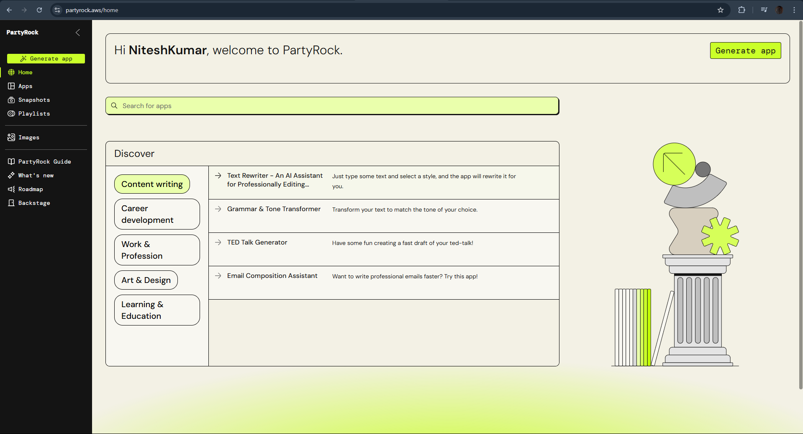
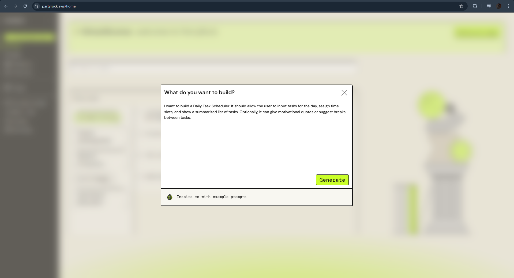
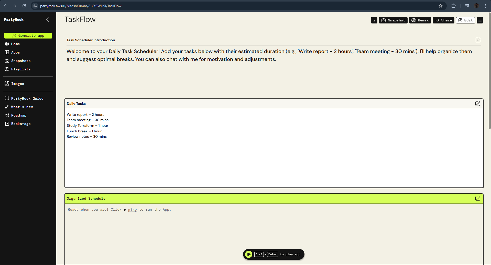
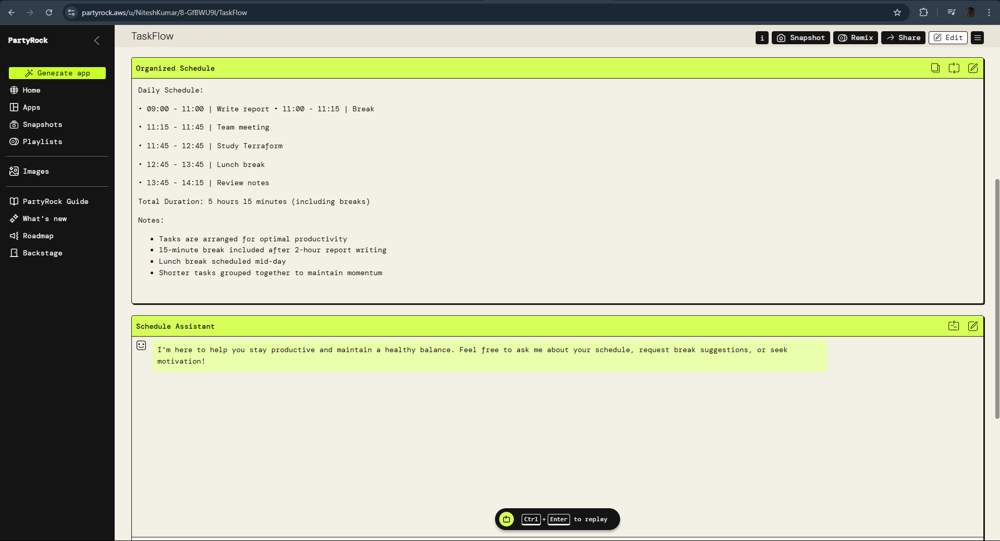
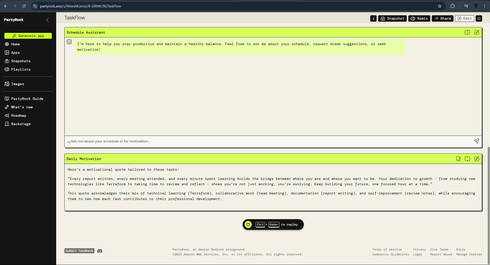

# 🗓️ Daily Task Scheduler App – PartyRock

This is a no-code Daily Task Scheduler built using **PartyRock** by Anthropic. The app lets you enter tasks with durations and returns a well-structured schedule with motivational quotes and a chatbot assistant.

## 🔗 Live Demo

👉 [Try the App Here](https://partyrock.aws/u/NiteshKumar/8-GfBWU9l/TaskFlow)

---

## ✨ Features

- ✅ Add daily tasks with estimated durations  
- ✅ Automatically generate a time-blocked schedule  
- ✅ Motivational quote generator  
- ✅ AI assistant chatbot for productivity advice  
- ✅ Built 100% with PartyRock (no coding required)

---

## 📸 Screenshots

| Input Screen | Output Schedule | Chatbot |
|--------------|-----------------|---------|
|  |  |  |
|  |  |  |

---

## ⚙️ How It Works

1. User enters tasks in a list
2. AI schedules tasks based on estimated time
3. App returns an optimized day plan
4. Motivational quote is shown
5. Optional: Interact with the chatbot

---

## 🚀 Built With

- [PartyRock](https://partyrock.aws) – No-code AI builder by Anthropic
- AI Models for planning and motivation

---

## 🙌 Author

**Nitesh Kumar**  
[Your GitHub Profile](https://github.com/nitesh210108)

---

## 📄 License

This project is open-source under the [MIT License](LICENSE).
